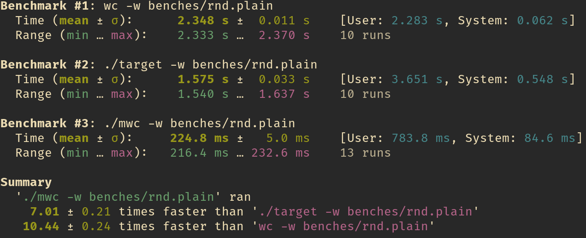

# Multithreaded Word Count
Neven Villani, ENS Paris-Saclay

```
$ mwc [-w|-l|-c] FILE
```

Count (w)ords, (l)ines or (c)hars in FILE.



## Structure

```
──┐
  ├── main.c              argument parsing, calls dispatch
  ├── dispatch.c          thread management, calls count
  ├── count.c             counters
  ├── *.h
  ├── Makefile
  ├── tests               correction
  │     ├── test.sh         check ./mwc against ./mwc-handout
  │     └── *.plain         tricky tests
  └── benches             performance
        ├── bench.sh        measure with hyperfine
        ├── testmake.sh     
        └── *.plain         massive tests (not included)
````

## Contents

### `main.c`

Error codes:
```c
#define WR_OPT 1
#define WR_ARG 2
#define WR_FILE 3
```

Argument rules:
- at most one of `-w`, `-c`, `-l` (otherwise `WR_OPT`)
- if no option is provided then `-w` is assumed
- no other argument may start with `'-'` (otherwise `WR_OPT`)
- exactly one file name (otherwise `WR_ARG`)
- file must exist and have read permissions (otherwise `WR_FILE`)
- arguments may be in any order

### `dispatch.c`

```c
#define NB_THREADS 5

typedef struct {
    const char* file;
    int start;
    int end;
    int count;
} zone_t;

int dispatch (const char* file, void* counter (void*));
```

`NB_THREADS` may safely be set to any reasonable strictly positive value to adjust to the number of cores available.

A `zone_t` describes the work each thread has to do : `file` is the name of the file they have to open, `start` and `end` delimit the area of the file they have to consider, `count` serves as a return value.

Threads have no obligation to check that the file exists or to ensure their zone is valid (`0 <= start <= end <= size(file)`), it is `dispatch`'s role to ensure they are.

More precisely, `dispatch` :
- determines the length of the file
- divides it evenly between the wanted number of threads
- sets up each `zone_t`
- launches one instance of the counter given as second argument per zone
- waits for thread termination
- sums up all results

### `count.c`

```c
#define BUFSIZE (16 * 1024)

int count_bytes (const char* file);

void* count_lines (void* data);

void* count_words (void* data);
```
Lowering `BUFSIZE` too much may decrease performance because of too many system calls and bounds checks.
Conversely, raising it may increase memory consumption.

`count_bytes` opens the file and returns its length (uses `lseek`, very fast).

```
fun count_bytes(file)
    open f as fd
    go to end of fd
    return position of cursor in fd
```

`count_lines` interpretes its argument as a `zone_t*` and counts the number of `'\n'` in the zone it was assigned.

```
fun count_lines(file, start, end)
    open file as fd
    jump to start in fd
    n <- 0
    for char c until end in fd
        if c == '\n'
            incr n
    return n
```

`count_words` splits on `' '`, `'\t'`, `'\n'`. It may read a single char outside of its zone to check if the last letters of its zone constitute a word.

It counts a word when it finds a separator or the end of the file directly after one of the characters in its zone.

```
fun count_words(file, start, end)
    open file as fd
    jump to start in fd
    n <- 0
    prev_blank = true
    for char c until end in fd
        if c is a separator
            if not prev_blank
                prev_blank = true
                incr n
        else
            prev_blank = false
    if not prev_blank
        c <- next char of fd
        if c is a separator
            incr n
    return n
```

Example:
```
|  thread 1  |  thread 2  |  thread 3   |
aaaaa a  aaaa a aaaaaaa aaaa a a a a a a
     ^ ^     ^ ^       ^    ^ ^ ^ ^ ^ ^ ^
     1 1     1 2       2    3 3 3 3 3 3 3
```
The last word of zone 1 has its end in the zone 1 but the separator in zone 2: thread 1 reads the first character of zone 2.

The first word of zone 3 had already begun in zone 2, but was not counted by thread 2.

The last word of zone 3 ends with an EOF and is counted by thread 3.

All the other words are fully inside their zone, and are counted by their respective thread.


## Utils

### `make` targets

- `make` builds `mwc`
- `make test` executes correction tests (see `test.sh`)
- `make bench` executes performance tests (see `bench.sh`)

### `test.sh`

Fixed tests are chosen for edge cases. They purposefully contain many consecutive spaces, long words, empty lines, etc...

Random tests are generated on the fly with sizes from `0B` to `100kB`. They are meant to ensure the program behaves correctly in a wide range of conditions.

For both fixed and random tests, `mwc` is checked against the binary we were given and that defines the behavior: `mwc-handout`.

### `bench.sh`

`bench.sh` uses [hyperfine](https://github.com/sharkdp/hyperfine) to accurately compare the performance of `mwc`, `mwc-handout` and `wc` on files typically `1M` to `1G` in size.

Those files are not provided with the code, but can be generated with `testmake.sh`.

The source code of `bench.sh` needs to be changed to chose which commands to compare and on which files.

### `testmake.sh`
